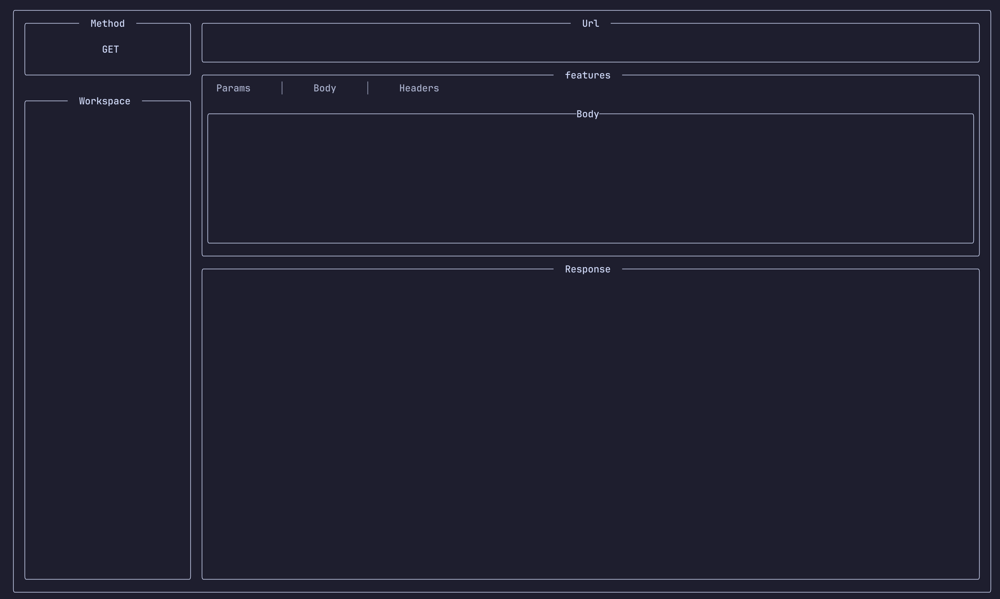

# 🦀 Rusty Client

**Rusty Client** is a terminal-based REST client written in Rust. It allows you to make HTTP requests directly from a TUI (Text User Interface), providing a fast and efficient way to interact with RESTful APIs without leaving the terminal.

**Forget the hassle of launching heavy apps or writing curl commands—Rusty Client brings fast, lightweight REST testing right to your terminal.**

## 📑 Table of Contents

- [Introduction](#introduction)
- [Preview](#Preview)
- [Features](#-Features)
- [Prerequisites](#-Prerequisites-Installation-Guide)
- [Installation](#-Installation)
- [Deploy / Development Setup](#-Deploy-&-Technologies)
- [Project Structure](#-Project-Structure)
- [Usage](#-usage)

- [Keyboard Shortcuts](#keyboard-shortcuts)
- [Documentation](#documentation)

## Preview
Here's a quick look at Rusty Client in action:




## ✨ Features

Rusty Client provides a fast and intuitive way to test REST APIs directly from the terminal. Key features include:

- 🔁 **Multiple HTTP Methods**  
  Send `GET`, `POST`, `PUT`, `DELETE`, and other requests easily.

- 📝 **Custom Headers and Body Input**  
  Add request headers and body data to test real-world API scenarios.

- 🎯 **URL Input Field**  
  Enter any API endpoint from the terminal UI.

- 📬 **Formatted Response Output**  
  View prettified responses including JSON and plain text with status codes.

- 🎨 **Terminal-Based UI (TUI)**  
  Built using `tui-rs` for a fast, minimal, and interactive user experience.

- 🧠 **Keyboard-Driven Navigation**  
  Navigate and trigger actions using keyboard shortcuts—no mouse required.

- 🛠️ **Lightweight & Fast**  
  Runs entirely in the terminal without the overhead of GUI apps like Postman.

- 📜 **Scroll & View Large Responses**  
  Easily scroll through long JSON/text response bodies.

- 🔌 **Modular & Hackable**  
  Code is organized and modular—easy to extend and customize.

## 🧰 Prerequisites Installation Guide

### ✅ What You Need

- Rust (includes Cargo, the Rust package manager)

- (Optional) Git – to clone the repository

🐧 Linux / 🐧 WSL (Ubuntu/Debian-based)
```bash
# Install Rust
curl --proto '=https' --tlsv1.2 -sSf https://sh.rustup.rs | sh

# Follow the on-screen instructions (usually restart your terminal)

# Optionally install Git if not installed
sudo apt update
sudo apt install git
```

🍎 macOS
```bash
# Install Rust (includes cargo)
brew install rustup-init
rustup-init

# Follow the on-screen instructions (choose default, then restart terminal)

# Install Git (if not already installed)
brew install git

#🍺 Install Homebrew (macOS)
/bin/bash -c "$(curl -fsSL https://raw.githubusercontent.com/Homebrew/install/HEAD/install.sh)"

#After installation, follow the post-install instructions to add Homebrew to your PATH. Usually:
echo 'eval "$(/opt/homebrew/bin/brew shellenv)"' >> ~/.zprofile
eval "$(/opt/homebrew/bin/brew shellenv)"
```
🪟 Windows
#### 1. Install Rust:
- Go to: https://rustup.rs

#### 2. Download and run the installer.
- After installation, restart your terminal or use the Rust command line.

#### 3. Install Git:
- Download from https://git-scm.com
- Follow the installation wizard.

#### Recommended Terminal:
- Use Windows Terminal or PowerShell for best experience.

## 🔧 Installation

**Instructions on how to get a copy of the project and running on your local machine.**

Installation
```bash
git clone git https://github.com/kirulegion/Rustty-Client
cd rusty-client
cargo build --release
```
Run
```bash
cargo run
```
Or, if built:
```bash
./target/release/rusty-client
```

## ⚙️ Deploy & Technologies
To deploy or initialize a new Rust TUI project like Rusty Client, you’ll need the following tools installed and configured:

#### 1. Rust Toolchain
- Includes rustc, cargo, and rustup.
- Used for building, running, formatting, and managing dependencies.

```bash
brew install rustup-init  # macOS (via Homebrew)
rustup-init               # Initializes the Rust toolchain
```

#### 2. Git
Version control for managing source code and collaborating with others.
```bash
brew install git
```

#### 3. TUI Library (tui crate)
- A Rust library for creating terminal UIs.
- Installed automatically via Cargo.toml:

```bash
[dependencies]
tui = "0.19"  # or latest version
```
#### 4. HTTP Client (reqwest crate)
- For sending HTTP requests.
```bash
[dependencies]
reqwest = { version = "0.11", features = ["json"] }
```

### 5. Serialization (serde, serde_json)
- For handling JSON responses.
```bash
serde = { version = "1.0", features = ["derive"] }
serde_json = "1.0"
```
#### 6. Terminal Emulator
- iTerm2 (macOS)
- Windows Terminal
- Alacritty
- GNOME Terminal

## 🗂️ Project Structure
The Rusty Client codebase is organized into modular folders to promote clarity, maintainability, and separation of concerns. Each directory handles a specific part of the application:
- ui/ – Contains all the terminal UI components, layout definitions, and rendering logic using TUI libraries.
- network/ – Manages HTTP requests and responses, wrapping around the networking logic with clients and response handlers.
- state/ – Defines and manages the global application state, including data models and state transitions.
- events/ – Handles user input, keyboard events, and maps them to application actions.
- utility/ – Includes reusable helper functions and tools such as logging, formatting, or parsing.
```bash
rusty-client/
├── src/
│   ├── main.rs              # Entry point   
│
│   ├── ui/                  # Terminal UI components
│   │   ├── mod.rs
│   │   ├── layout.rs
│
│   ├── network/             # HTTP logic, request handling
│   │   ├── mod.rs
│   │   ├── client.rs
│   │   └── response.rs
│
│   ├── state/               # Application state and models
│   │   ├── mod.rs
│   │   ├── app_state.rs
│
│   ├── events/              # Input events and user actions
│   │   ├── mod.rs
│   │   └── handler.rs
│
│   ├── utility/             # Reusable helpers and utils
│   │   ├── mod.rs
│   │   └── formatter.rs
│
├── Cargo.toml               # Dependencies and metadata
├── Cargo.lock               # Auto-generated lockfile
└── README.md                # Project documentation

```
